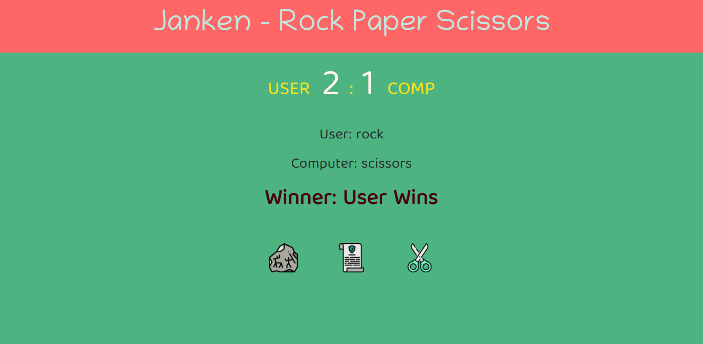

# Description
This is a mini project done in HTML, CSS and Javascript. Rock, Paper and Scissors was a fun project and in this project the number of rounds are best of five. Computer chooses at random and score resets when user or comp reaches the score of 3. Winner is displayed and scores are reset. 
## Time Taken

1 hour and 30 mins approximately

[Live Demo](https://rockpaperscissors-akj.netlify.app/)

### SnapShot of the program

